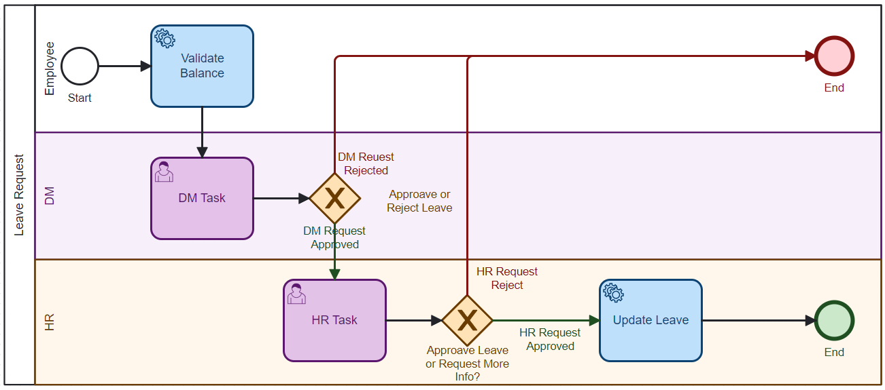

# Camunda Leave Request Process

Dieses Repository dient als Beispielprojekt, um den Umgang mit **Camunda BPMN** und die Modellierung eines einfachen Urlaubsantragsprozesses (Leave Request Process) zu demonstrieren.

## Überblick

Das Projekt implementiert einen einfachen Workflow zur Beantragung und Genehmigung von Urlaubstagen. Es zeigt, wie man mit Camunda BPMN einen Prozess modelliert und diesen in einer Spring Boot-Anwendung integriert, ohne eine externe Camunda Engine installieren zu müssen. Der Urlaubsantragsprozess umfasst die Validierung der angeforderten Urlaubstage und die Aktualisierung des Urlaubsstatus, basierend auf den genehmigten Tagen.

## Technologie-Stack

- **Camunda BPMN Spring Boot Starter**: Zur Modellierung und Ausführung von BPMN-Prozessen in einer Spring Boot-Anwendung.
- **Spring Boot**: Zur Implementierung des Backend-Services.
- **Java**: Programmiersprache für die Geschäftslogik.
- **Maven**: Build-Management-Tool.

## Installation

### Voraussetzungen

Stellen Sie sicher, dass Sie die folgenden Tools installiert haben:

- **Java JDK 17** oder höher.
- **Intellij IDEA** (IDE) mit aktiviertem **Maven Plugin** (ist standardmäßig integriert).

### Schritte zur Installation

1. Klonen Sie das Repository:
   ```bash
   git clone https://github.com/AhmesElyacoubiForJ/Camunda-LeaveRequest.git
   ```
   
2. **Projekt in IntelliJ IDEA öffnen**:
   - Öffnen Sie IntelliJ IDEA und klicken Sie auf **Open**.
   - Navigieren Sie zum Verzeichnis, in dem Sie das Repository geklont haben, und wählen Sie es aus.

3. **Anwendung starten**:

4. Öffnen Sie die Camunda Web-Interface im Browser unter `http://localhost:8080/`, um den Prozess zu testen.

    - Die Camunda Web-Anwendung ermöglicht es Ihnen, den Prozess zu überwachen und mit den Tasks zu interagieren.

## Nutzung

1. Erstellen Sie einen Urlaubsantrag über das Camunda Cockpit oder die Tasklist.
2. Der Prozess wird die beantragten Urlaubstage validieren.
3. Nach der Genehmigung wird der Urlaubsstatus auf "Genehmigt" gesetzt.

## Weitere Schritte

- Weitere Erweiterungen des Prozesses können hinzugefügt werden, z. B. Benachrichtigungen oder Integrationen mit anderen Systemen.
- Der Prozess kann mit verschiedenen BPMN-Modellen und -Aufgaben angepasst werden.

## Beitragende

- [A. El Yacoubi](https://github.com/AhmedElyacoubiForJ)

## Struktur des Projektes
```
src/
└── main/
    ├── java/
    │   └── edu.yacoubi.LeaveRequest/
    │       ├── servcie/
    │       │   └── delegate/
    │       │       ├── UpdateLeaveDelagate.java
    │       │       └── ValidateVacationDaysDelegate.java
    │       ├── util/
    │       │   ├── VacationValidator.java
    │       │   └── ValidationConstants.java
    │       └── Main.java
    └── resources/
        ├── archive/
        │   └── process.bpmn
        ├── application.yaml
        └── LeaveRequestProcess.bpmn
z_docs/
├── leave-request-process.png
└── LeaveRequestProcess.md
.gitattributes
.gitignore
pom.xml
README.md
```

## BPMN Prozessdiagramm

Hier ist das Prozessdiagramm des Urlaubsantrags:




